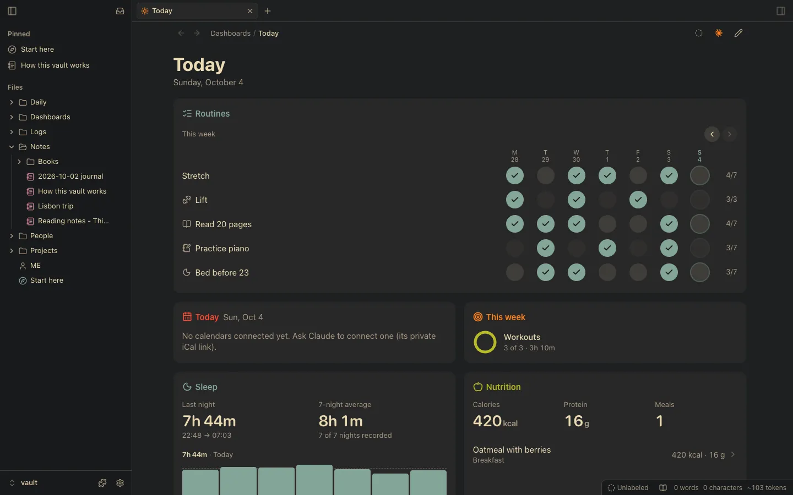
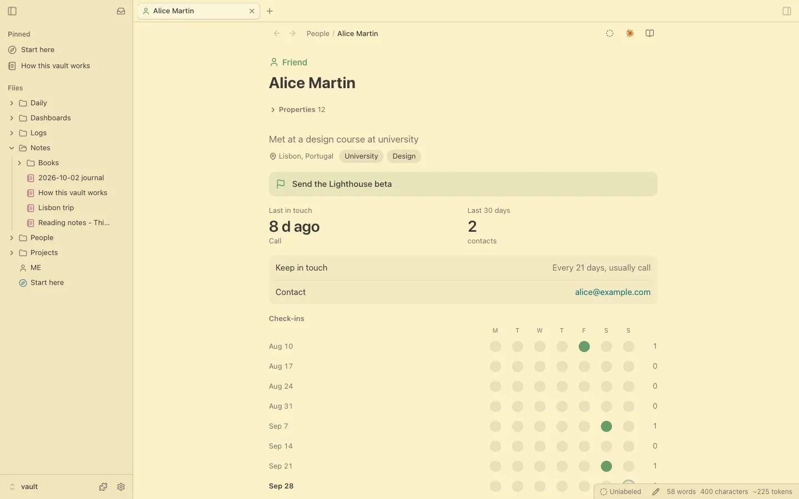
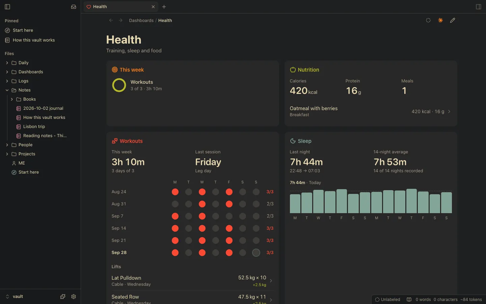

<h1 align="center">
  <br>
  <p>Vaultite</p>
</h1>

<p align="center">
  Your personal knowledge base and wiki, in plain Markdown files you own, collaborating with your AI.
  <br>
  <a href="https://github.com/Vaultite/vaultite/releases/latest/download/Vaultite.dmg">Download</a>
</p>

<p align="center">
  
  
  
</p>

<p align="center">
  
  
  
</p>

## What it is

A folder of Markdown files (your vault) that you or your AI (Claude, ChatGPT, OpenClaw, Hermes) writes in and Vaultite
draws as pages.

- **Plain files, no database.** Open the same vault in another Markdown app, grep it, sync it with iCloud or keep it in git.
- **Made for agents.** Claude Code, Codex and any MCP client use one set of operations (the `vau` CLI, MCP, HTTP).
- **Everything is a plugin.** Modular and hot-reloadable. People, logs, notes, even the file tree; turn them off or write your own in the vault.
- **Also a full editor and workspace**: live preview, tabs and splits, backlinks, graph, terminals for your agents, on
  the Mac, the web and the iPhone.

## Get started

[**Download Vaultite.dmg**](https://github.com/Vaultite/vaultite/releases/latest/download/Vaultite.dmg), drag it to
Applications, and open it (on Linux: the [AppImage or the .deb](https://github.com/Vaultite/vaultite/releases/latest);
`sudo apt install ./vaultite_*.deb` also sets up Chromium's sandbox on Ubuntu 24.04+): make a vault (or open a folder of Markdown, changing none of it), and it opens, minimal, with a
terminal to run Claude Code or Codex in. Or try the playground (a made-up vault) first. More is a
bundle away (Life OS: your days, people and health), and the MCP plugin puts claude.ai and ChatGPT on it.

Agents started in Vaultite's terminals already know the vault; elsewhere, by hand:

```sh
claude mcp add vaultite -- vau mcp
```

Skills that teach any agent the vault's rules and how to write a plugin: `npx skills add Vaultite/vaultite`, or in
Claude Code `/plugin marketplace add Vaultite/vaultite` and `/plugin install vaultite@vaultite`.

Try "log a 30 minute run this morning" or "what did I tell you about Alice?".

## Run from source

```sh
npm ci && npm run build                              # Node.js 23.6 or later
node bin/vau sandbox /tmp/vaultite-sandbox           # a made-up vault, dated as of today
VAULTITE_VAULT=/tmp/vaultite-sandbox npm start       # http://127.0.0.1:8793
```

No accounts: keep it on `127.0.0.1` or a private network like Tailscale ([SECURITY.md](SECURITY.md)). The desktop and
iPhone apps, tests and how to send a change: [CONTRIBUTING.md](CONTRIBUTING.md). Your own plugin: `vau plugin new <id>`
([vault plugins](core/docs/vault-plugins.md)).

## Run it on a server

The server runs on Linux too, on a box at home or a VPS, next to agents like Claude Code, OpenClaw or Hermes. Open it
from the desktop app (Connect to a server), the iPhone app or a browser on your tailnet.

```sh
git clone https://github.com/Vaultite/vaultite && cd vaultite
npm ci && npm run build                          # on Linux, node-pty builds with build-essential and python3
node bin/vau service install --vault ~/Vault     # a systemd user unit (launchd on a Mac), running now and at boot
tailscale serve --bg --https=8447 http://127.0.0.1:8793
```

Then add `https://<machine>.<tailnet>.ts.net:8447` in the app, and apply the Self-hosted bundle.

## License

[Apache 2.0](LICENSE).
