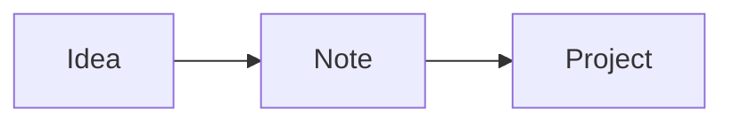

The app's design system, as one file: every block and every piece of Markdown it draws, drawn live on your data. Pages are made by putting these together. A block is a fence, ```` ```block-<name> ````, with its options inside as YAML. Switch to editing (⌘E) to see how each one is written, and copy it into any file.

## Layout

The primitives that arrange a page, and the options every block takes.

| Primitive | How |
| --- | --- |
| Grid | A dashboard (`type: dashboard`, drawn by the Dashboards plugin) lays its blocks out in two columns; one in a narrow pane or on a phone; with Dashboards off, one under another like any file |
| `wide: true` | The block takes the whole row |
| `stack: true` | The block goes under the one before it, in the same column |
| `file: <name>` | Any block, drawn for another file: a name or path like a `[[link]]`, or a folder ending in `/` for its newest file |
| Options | Each block's own are declared by its plugin (`vau blocks <name>`); typing in a block suggests them. One it doesn't take, or of the wrong type, gets a quiet line under the block while editing, and the block is drawn anyway |
| Markdown | Any text between blocks takes a row of its own, like this one |
| Tabs | A page's views are files: the first lists them, `tabs: [People map]`, and each names its label, `tab: Map` |
| Embeds | `![[Spending.html]]` or `![[Transactions.csv]]` on a line of its own: an interactive page or a table (`\|400`: its height); a PDF, audio, video, or a file a plugin draws (`![[Board.canvas]]`: a canvas of cards and arrows) the same way; a note (`![[Note]]`, a section `![[Note#Heading]]`, a block `![[Note#^id]]`) is its text |
| Frontmatter | `icon` (a lucide name), `tint` (a colour token), `subtitle` (`{date}` is today), `plugin` (hidden while it's off) |
| Archived | "Archive" in a file's menu: moved into `.archive/` in its folder with `archived: true` (hidden in the file tree until "Show archived files", then dimmed), left out of the sidebar, lists, the graph and database views, last in search |

Right-click any block (hold a finger on it on a phone) for where its data comes from: the files it shows (a click opens one), its plugin's settings and cache, and what's live; then Options (a form) and Edit source. In the editor a block stays drawn when clicked: hover for its bar, whose </> shows its Markdown.

Every block shows the same states, drawn by the app: "Loading…" while its data comes, a line in its place if it can't be drawn (the rest of the page stays), and, outside a dashboard, a line saying its plugin is off (a dashboard leaves it out).

Toasts are the one thing the app draws outside pages: a short line at the bottom of the window that goes away by itself, with one button at most ("Moved to Notes · Undo"; an error has a red icon). A plugin shows one with `notify(text)`, an agent with `vau notify "text"`.

## Markdown

Text is **bold**, *italic*, ~~struck~~, `code`, a [link](https://example.com), or a [[ME|wikilink]] to any file (grey when nothing has that name yet). A Markdown link goes anywhere too: a note (`[x](Note)`), a file (`[pdf](files/a.pdf)`) or another app (`obsidian://`, `zotero://`, `tel:`). When several files have a name, the closest to the linking file wins; a link to nothing that looks like another name ("Alice" for Alice Park) asks "Did you mean".

### A small heading

- A bullet list
- Another item
  - Nested

1. A numbered list
2. Second

- [x] A task list, done
- [ ] Not yet

> A quote, for something someone said.

| Table | Of things |
| --- | --- |
| Rows | Line up |
| In columns | Too |

```
A code block keeps its spacing.
```

```ts
// A code block that names its language is highlighted, with a copy button
const greet = (name: string) => `Hello, ${name}`
```

> [!tip] A callout
> A quote whose first line is `[!type]` and a title: note, tip, info, warning, danger, question, quote, example, success, failure, bug, abstract, todo.

> [!warning]- A folded callout
> A `-` after the type starts it folded, a `+` open; click its title to toggle it.

A footnote goes after a word[^1], its text anywhere in the file.

Marks: ==a highlight==, a tag like #design/markdown (click it for the files that have it; it nests under #design, and this page is the one file that has it), `%%a comment%%` that reading hides, and `^an-id` at the end of a paragraph or list item, hidden too, so a link can go to it. ^design-marks

A link goes to a place in a file: [[#Markdown]] a heading in this one, [[Me#About me]] a heading in another, [[#^design-marks]] a block. A note, a section or a block embedded shows its text, like the paragraph above (on a line of its own, or in the middle of one):

![[#^design-marks]]

An image, `![[photo.png]]` or ``, shows where it's written: `|300` sets its width (drag its corner), its buttons open it and show its Markdown, and right-click (hold on a phone) is its menu: copy, open, rename, move, reveal, reset its size, remove it or delete the file.

Math: $E = mc^2$ in a line, or a block of its own:

$$
\sum_{k=1}^{n} k = \frac{n(n+1)}{2}
$$



HTML is drawn as written, but safe: H<sub>2</sub>O, x<sup>2</sup>, <kbd>Esc</kbd>, a <span style="color: var(--red)">coloured</span> word, a line<br>break, and a toggle:

<details>
<summary>A toggle</summary>

What's inside shows when it's opened.

</details>

---

In the editor, `/` at the start of a line lists all of this, every block below and your templates, to put in.

In a note (not a dashboard), a `## Timeline` section is drawn as a timeline: lines like `- 2026-09-28 · call · 30m · Caught up`.

[^1]: Footnotes are numbered in the order they're referenced; hover one to read it, click it to go to its text.

## Today

`routines`: today's routines, tap to tick. `agenda`: the calendar's next events. `week-goals`: this week against each area's goal (`areas: [workouts, study]`, `title`).

```block-routines
wide: true
```

```block-agenda
```

```block-week-goals
```

## Logs

`area`: one area's logs (`area: workouts`, required; `meta`: a field, or a list of them, shown on each row; `total`: a number field summed over this week, in place of the last session; `empty`: the text when there are none). `log`: a log file's fields (a file block).

```block-area
area: workouts
meta: [volume_kg]
total: volume_kg
```

```block-log
file: Logs/
```

## Health

`sleep` (`nights: 7`), `nutrition` (today's meals), `workouts` (an area's recent sessions, its lifts or top grade: `area: workouts`). `workout`: a workout log's exercises or climbs (a file block).

```block-sleep
```

```block-nutrition
```

```block-workouts
```

```block-workout
file: Logs/Workouts/
wide: true
```

## Books

`books`: reading and want to read. `book`: one book's progress (a file block).

```block-books
```

```block-book
file: Books/
```

## Lessons

`lessons`: lessons in progress, cards files and the cards due now, with a Review button. A lesson (`type: lesson`) and a cards file (`type: cards`) draw as pages of their own.

```block-lessons
```

## People

`people-due`: who's due a call. `people-wants`: who you want to reach out to. `people-group`: a list of people (`title`, `relations: [friend, roommate]`). `person`: a profile (a file block). `people-map`: everyone's pin, and the same people by place (`places: false` leaves that list out).

```block-people-due
```

```block-people-wants
```

```block-people-group
title: Friends
relations: [roommate, friend]
```

```block-person
file: People/
```

```block-people-map
wide: true
places: false
```

## Projects

`projects`: a card per project, each drawing its own file's blocks. `project`: status, tagline and links (a file block).

```block-projects
wide: true
```

```block-project
file: Projects/
```

## Database views

`query`: the files that match a query, as a table, cards, a list, a board or a calendar, like a database: `from` (a folder), `type`, `tags`, `where` (`relation = friend and every_days <= 30`: `= != < <= > >= contains`, `and`, `or`, `not`, `has <key>`), `columns` (frontmatter keys, and `file`, `folder`, `updated`, `created`), `sort` (`-updated`: descending), `group`, `groups` (the groups in order: `[idea, building, live]`), `view` (`table`, `cards`, `list`, `board`, `calendar`, `map`), `limit`, `title`, `archived` (`true`: archived files too, `only`: only them), and what a `.base` file has: `filters` (Bases expressions: `file.hasTag("book") && status != "done"`), `formulas` (computed columns, `formula.left`), `properties` (column labels), `summaries` (`{pages: Sum}`: under the column). Click a heading to sort, a row to open it, double-click a value to change it. A `board` is a column per value of `group` (and No value): drag a card to another column, or use its … menu, to change that key in the file. A `calendar` is a month by `date` (a date key; default `date`, else `created`; `month: 2026-09` to start on another month): arrows change the month, drag an item to another day to move its date; narrow, it's a list of the days.

```block-query
title: People
type: person
columns: [file, relation, location, every_days]
group: relation
wide: true
```

```block-query
title: Recently changed
where: "type != dashboard"
columns: [file, folder, updated]
sort: -updated
view: list
limit: 6
```

```block-query
title: Projects by status
type: project
view: board
group: status
groups: [idea, building, live, paused]
columns: [file, tagline]
wide: true
```

```block-query
title: Logs this month
type: log
view: calendar
date: date
columns: [file, area]
wide: true
```

```block-query
title: People on a map
type: person
view: map
columns: [file, location]
wide: true
```

A `map` puts a pin per file where its `coordinates` say (`[lat, lon]`; `coordinates: <key>` for another), coloured by `markerColor`. A ```` ```base ```` fence is a base inline, its YAML as a `.base` file has it (`![[Books.base]]` and `![[Books.base#View]]` embed a file's): filters, formulas, display names, summaries, and its views as tabs.

```base
filters: 'type == "book"'
formulas:
  left: if(total_pages, total_pages - current_page, "")
properties:
  formula.left:
    displayName: Pages left
views:
  - type: table
    name: Books
    order: [file.name, author, status, formula.left]
    summaries:
      formula.left: Sum
  - type: cards
    name: Shelf
    order: [file.name, author]
```

`this` in a `where` (or Bases' `filters`) is the note the view is in: here this page; embedded (`![[Linked here]]`), the note embedding it, so one note with this view, embedded in every project, lists what links to each. `project = this` (a property naming it), `status = this.status` (the same value as its own). Keys with a type (`.vaultite/types.json`: `vau properties types`) sort and compare as it: dates by time, numbers as numbers.

```block-query
title: Linked here
where: "file.links contains this"
columns: [file, folder]
view: list
```

## Graph

`graph`: the file's neighbours in the vault's graph, files as dots and [[links]] as lines (`depth: 1`, `2` or `3` links away; `height` in px; `title`). Click a dot to open it; drag to pan, the wheel or a pinch to zoom. "Open graph view" shows the whole vault in a tab.

```block-graph
depth: 2
height: 280
```

## Activity

`activity`: what was done to the vault and the app, and by whom (you, coding agents, the CLI, scripts, changes on disk), newest first and live, with chips to filter by who (`limit: 30`; `actor: agent`; `path: this` for the file the block is in, or a vault path); click a file to open it, an agent's row for its terminal. `activity-summary`: the last 24 hours by hour (`days: 7`: by day), stacked by you, agents and the rest, then who and the files touched most. `perf-server`: the server's uptime, memory, event loop delay and requests, with per-minute response times and requests (`minutes: 1440`). `perf-routes`: each API route's count and timings, and the slow requests. `perf-app`: what each app window reports about its own speed. `recap`: what you did on a day as a timeline (notes made and changed with the text changed, tasks done or dropped, captures, logs, agents' sessions), stepping by day, week or month with chips by kind (`date:`, else the daily note's date, else today; `days: 7`); the day's file, `Recaps/<date>.md`, reads as the same timeline. `recap-stats`: the last weeks as a grid of days, darker the more done (click one for its recap), and how many of each kind (`weeks: 10`).

```block-recap-stats
wide: true
weeks: 10
```

```block-recap
wide: true
```

```block-activity-summary
wide: true
```

```block-activity
limit: 8
wide: true
```

```block-perf-server
wide: true
minutes: 180
```

```block-perf-routes
```

```block-perf-app
```

## Errors

`errors`: the errors the app and the server hit, the latest first, each kind once with a count (`limit: 20`; `source: app` or `server`; `title`). Open one for its stack, React's component stack and each time it happened (device, address, build, what you did just before), then Copy or Forget it.

```block-errors
limit: 5
```

## Inbox

`inbox`: what's new. Results to review (files in Inbox/, status new: Done, or … for Archive and File to…) and the agents' latest events (finished, waiting for you; a click goes to the terminal or the session it was in; unread ones have a dot). `events: 5` and `results: 10` say how many of each (0 hides them); `title`.

```block-inbox
events: 3
```

`reply`: the reply box at the end of an agent's report (`vau inbox report` writes it): what's typed (or dictated) goes back into the agent's session, its terminal if it still runs, else the session resumed in the background while its context is cached, else a new session that reads the report (a line under the box says which, and offers the other); the reply is kept in the report and the report is done. Open session goes to its terminal. Anywhere else it says what it's for.

```block-reply
```

## Claude Code and this machine

`claude-limits`: plan limits (each account's, with several). `claude-sessions`: open and recent sessions (`recent: 5`; click one for its terminal or its conversation), and the Remote Control servers running. `claude-usage`, `claude-projects` and `claude-models` (`days: 30`). `claude`: one project's usage (a file block; `project: <folder>`). Every agent block takes `account: <id>` (one of Claude Code's accounts) and `machine: <id>` (another machine's).

```block-claude-limits
```

```block-claude-sessions
recent: 3
```

```block-claude-usage
days: 7
```

```block-claude-projects
days: 7
```

```block-claude-models
days: 7
```

```block-claude
file: Projects/
```

## Machines

`machines`: your other computers running Vaultite, whether they answer and what they run; click one for a terminal or an agent there.

```block-machines
```

## Codex

The same blocks for OpenAI's Codex (the agents' blocks are one set of components, `AgentUsage.tsx`): `codex-limits` (the ChatGPT plan's 5-hour and weekly limits), `codex-sessions`, `codex-usage`, `codex-projects`, `codex-models`, and `codex` in a project file.

```block-codex-limits
```

```block-codex-sessions
recent: 3
```

```block-codex-usage
days: 7
```

```block-codex-projects
days: 7
```

```block-codex-models
days: 7
```

```block-codex
file: Projects/
```

## Cursor

`cursor-limits`: the plan's included usage (and Grok Bot's week). `cursor-sessions`: open and recent chats (`recent: 5`). `cursor-usage`, `cursor-projects` and `cursor-models` (`days: 30`). `cursor`: one project's usage (a file block; `project: <folder>`).

```block-cursor-limits
```

```block-cursor-sessions
recent: 3
```

```block-cursor-usage
days: 7
```

```block-cursor-projects
days: 7
```

```block-cursor-models
days: 7
```

```block-cursor
file: Projects/
```

## OpenCode

The same blocks for OpenCode, with the cost OpenCode recorded (0 for free models): `opencode-sessions`, `opencode-usage`, `opencode-projects`, `opencode-models`, and `opencode` in a project file. OpenCode has no plan limits, so it has no limits block.

```block-opencode-sessions
recent: 3
```

```block-opencode-usage
days: 7
```

```block-opencode-projects
days: 7
```

```block-opencode-models
days: 7
```

```block-opencode
file: Projects/
```

## OpenClaw

The same blocks for OpenClaw, with the cost OpenClaw recorded: `openclaw-sessions`, `openclaw-usage`, `openclaw-projects`, `openclaw-models`, and `openclaw` in a project file; its agents are the `account:`. `openclaw-memory`: an agent's memory files and latest daily notes, read only (`notes: 2`). `openclaw-cron`: its scheduled jobs.

```block-openclaw-sessions
recent: 3
```

```block-openclaw-usage
days: 7
```

```block-openclaw-projects
days: 7
```

```block-openclaw-models
days: 7
```

```block-openclaw
file: Projects/
```

```block-openclaw-memory
notes: 1
```

```block-openclaw-cron
```

## Hermes

The same blocks for Hermes Agent, with the cost Hermes recorded: `hermes-sessions`, `hermes-usage`, `hermes-projects`, `hermes-models`, and `hermes` in a project file; `account:` picks one of its profiles. Hermes has no plan limits, so it has no limits block. Two of its own, read only: `hermes-cron`, its scheduled jobs, and `hermes-memory`, its SOUL.md and each entry of what it remembers.

```block-hermes-sessions
recent: 3
```

```block-hermes-usage
days: 7
```

```block-hermes-projects
days: 7
```

```block-hermes-models
days: 7
```

```block-hermes
file: Projects/
```

```block-hermes-cron
```

```block-hermes-memory
```

## AI import

`memory-review`: in a review list of memories from ChatGPT's or Claude's export (`Chats/ChatGPT/Memories to review.md`), how many are left and ticked, and Add: the ticked ones go into ME.md or the person's file. Here, with no list, it says there's nothing to review (`file:` draws another file's).

```block-memory-review
```
