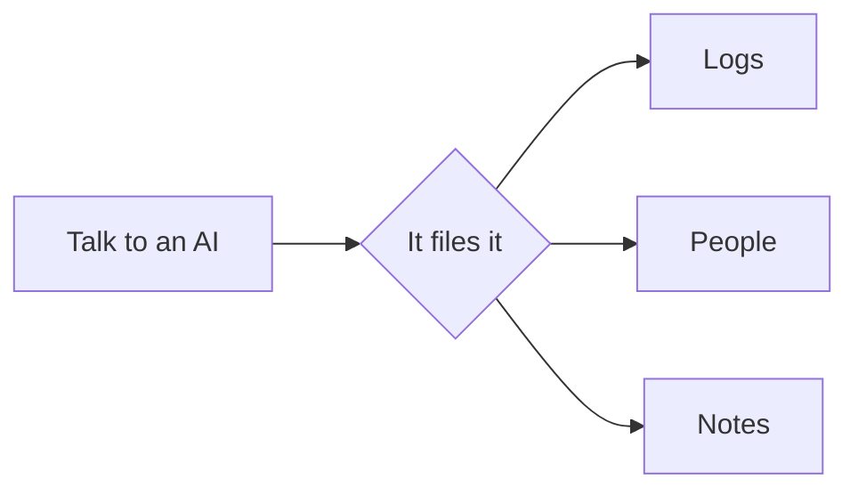

A vault is a folder of plain Markdown files. There's no database: open any file in another editor and it reads fine. To see how each piece below is written, switch to editing (⌘E) and put the cursor on it, or pick *Switch to source mode* in the palette (⌘P) to see the whole file as it's saved.

## Where this vault keeps things

| Folder | What's in it | Drawn on |
| --- | --- | --- |
| `People/` | A file per person, with a timeline | People and its map |
| `Logs/` | Workouts, sleep, meals, reading, practice | Health, Learning |
| `Daily/` | Each day's note, and the routines | Today |
| `Notes/` | Ideas, journals, books | |
| `Projects/` | A file per project, and its notes | Projects |

What a file is comes from the `type:` in its frontmatter, never its folder, so move things wherever you like (a file without one is a plain note). Pages like [[Today]] live in `Dashboards/`.

> [!tip] AIs follow the same rules
> The app gives any AI it starts the vault's rules (`.vaultite/AGENTS.md`: a line from each plugin that's on, then your own rules at its end), and each kind of file's format on demand. To have AIs started elsewhere find them too, turn on *Point AIs at the rules* in the Agent files plugin.

## Links and embeds

Links go to files ([[Alice Martin]]), headings ([[Lighthouse#Next]]) or a single line in a note ([[Lighthouse#^beta]]). An embed shows another note's section in place:

![[Lighthouse#Decisions]]

## Tasks

- [x] Write the README
- [ ] Ask [[Dave Kim]] for a last look
- [ ] Book flights to Lisbon

## Math and diagrams

$$
\text{days left} = \frac{476 - 212}{25 \text{ pages a day}} \approx 11
$$

## More

> [!info]- A folded callout
> Click the title to open it. Callout types: note, tip, info, warning, danger, quote and more.

A footnote goes after a word[^1]. ==Highlights==, ~~strikethrough~~ and `%%comments%%` work too. %%This one is hidden when reading.%%

[^1]: Footnotes are numbered and listed at the end.
