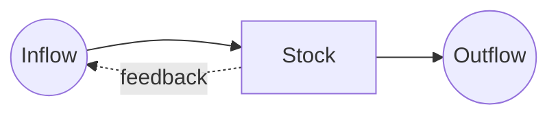

Notes on [[Thinking in Systems]].

A stock changes by its flows: $\frac{dS}{dt} = \text{inflow} - \text{outflow}$.

> [!quote] Donella Meadows
> A system is more than the sum of its parts.

- Habits are stocks: one workout doesn't change much, a year of them does. See [[Health]].
